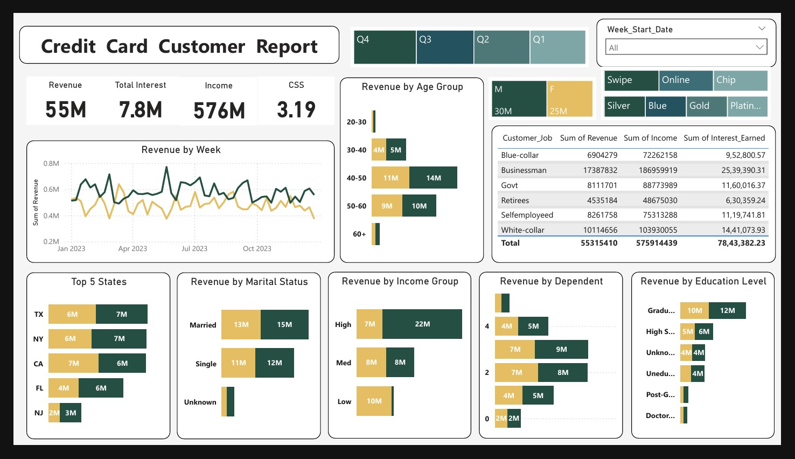
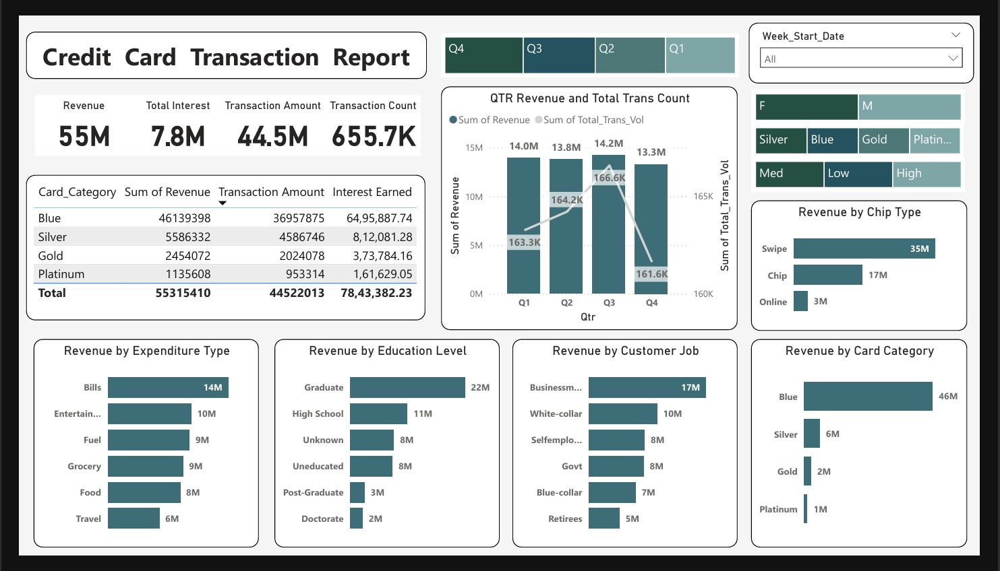

# Credit Card Financial Report - Power BI Dashboard

## Overview
The **Credit Card Financial Report** is an interactive Power BI dashboard that provides real-time insights into transaction and customer data from a SQL database. The dashboard helps monitor key financial performance metrics, streamlines data processing and analysis, and provides stakeholders with actionable insights to support data-driven decision-making.

## Preview

## Features
- **Real-time Analytics**: Visualizes live data from the SQL database for up-to-date insights into credit card transactions.
- **Interactive Dashboards**: Users can interact with the data to filter, drill down, and analyze metrics based on various dimensions (e.g., transaction type, customer profile, date ranges).
- **Key Performance Metrics**: Displays important KPIs such as total spending, transaction frequency, customer retention, and more.
- **Data Processing & Transformation**: Streamlined ETL (Extract, Transform, Load) processes to efficiently handle and prepare data for analysis.

## Key Benefits
- **Actionable Insights**: Enables stakeholders to make informed decisions based on real-time data visualizations.
- **Customizable Views**: Tailored dashboards with drill-down capabilities, enabling users to explore data based on their specific needs.
- **Improved Reporting Efficiency**: Reduces manual reporting tasks and provides a comprehensive, automated view of financial data.

## Technologies Used
- **Power BI**: For creating the interactive dashboard and data visualizations.
- **SQL Database**: For storing and retrieving transaction and customer data.
- **DAX**: For calculations and data transformations within Power BI.
- **Power Query**: For data transformation and cleaning before visualizations.

## Data Sources
The dashboard leverages transaction and customer data stored in a SQL database. Key data includes:
- Transaction details (e.g., amount, date, type)
- Customer profile information (e.g., customer ID, demographics)
- Historical trends in credit card usage

## How It Works
1. **Data Extraction**: Data is extracted from a SQL database, using SQL queries to pull relevant transaction and customer information.
2. **Data Transformation**: Data is cleaned and transformed using Power Query to ensure consistency and accuracy for analysis.
3. **Data Modeling**: Relationships between tables are established within Power BI for effective reporting.
4. **Visualization**: Power BI visualizations such as bar charts, line graphs, and pie charts are used to represent key metrics, providing an intuitive view of the data.
5. **Interaction**: Users can interact with the dashboard by applying filters or drilling down to specific data points for a deeper analysis.

## Conclusion
This Power BI dashboard offers a comprehensive, real-time view of credit card financial performance and customer behavior. By streamlining data processing and providing actionable insights, it supports key decision-making processes for stakeholders.

## Acknowledgments
- **Guided by**: Rishabh Mishra
